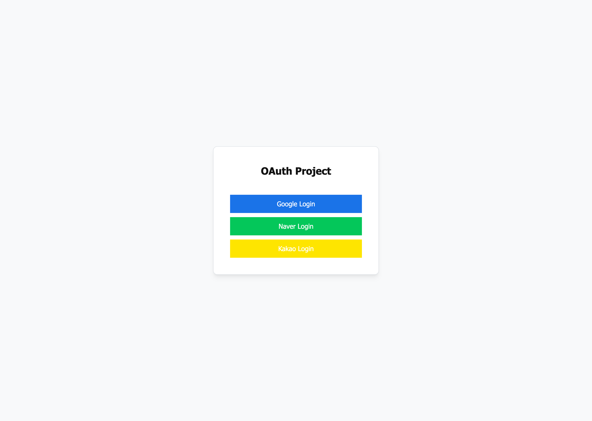
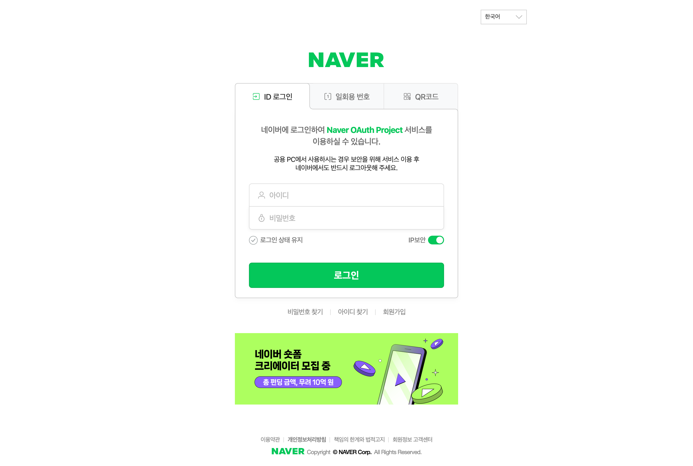

# oauth-sample
> Google, Naver, Kakao OAuth2 Sample.

<br>

## Development Environment
<div style="display: inline-block">
    
    
    
    
    
    
    
</div>

- IDE : IntelliJ IDEA
- Language : JAVA 11 (JDK 11.0.18)
- Framework : Spring Boot 2.7.8
- Build Tool : Gradle 7.6
- DBMS : MySQL 8.0.31 for Linux

<br>

## Main Function
- 회원(User)
    - 로그인
    - 로그아웃
    - 회원가입
    - 회원탈퇴

<br>

## Create MySQL Database
```SQL
create database oauth;
create hoong@localhost identified by '8888';
grant all privileges on oauth.* to hoong@localhost;
```

<br>

## MySQL Database Table
```SQL
drop table if exists user;

create table user (
    id       bigint primary key not null auto_increment,
    email    varchar(255) null,
    name     varchar(255) null,
    password varchar(255) null,
    provider varchar(255) null,
    role     varchar(255) null
);
```

<br>

## Swagger
```shell
http://localhost:8080/swagger-ui.html
```

<br>

## View
###### Index


###### Google Login


###### Naver Login


###### Kakao Login

